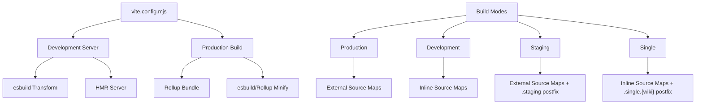

# Design Document

## Overview

This design document outlines the migration strategy from Webpack 5 to Vite for the Convenient Discussions project. The migration will leverage Vite's modern tooling ecosystem (esbuild, Rollup) while maintaining all existing functionality and build modes required for MediaWiki deployment.

## Architecture

### Build System Architecture



### Plugin Architecture

The Vite configuration will use a modular plugin approach:

1. **Core Plugins**: Built-in Vite functionality
2. **Asset Processing Plugins**: Less, CSS, Worker handling
3. **Custom Plugins**: Banner injection, filename customization, license extraction
4. **Environment Plugins**: Mode-specific behavior

## Components and Interfaces

### 1. Vite Configuration Structure

```javascript
// vite.config.mjs
export default defineConfig(({ mode, command }) => {
  const buildMode = determineBuildMode(process.env, mode);

  return {
    // Base configuration
    build: getBuildConfig(buildMode),
    plugins: getPlugins(buildMode),
    server: getDevServerConfig(buildMode),
    define: getEnvironmentVariables(buildMode)
  };
});
```

### 2. Build Mode Detection

```javascript
interface BuildMode {
  isDev: boolean;
  isStaging: boolean;
  isSingle: boolean;
  project?: string;
  lang?: string;
  wiki?: string;
  filenamePostfix: string;
}

function determineBuildMode(env: NodeJS.ProcessEnv, mode: string): BuildMode
```

### 3. Plugin System

#### Core Plugins
- `@vitejs/plugin-legacy` (if needed for browser compatibility)
- Built-in CSS processing
- Built-in worker handling

#### Custom Plugins
- `vite-plugin-banner` - For nowiki tags and license banners
- `vite-plugin-worker-inline` - For inline worker bundling
- Custom filename plugin - For mode-specific postfixes
- Custom source map plugin - For external source map URLs

### 4. Asset Processing Pipeline

#### Less Processing
```javascript
// Native Vite CSS processing with Less
css: {
  preprocessorOptions: {
    less: {
      // Less-specific options
    }
  },
  postcss: {
    // PostCSS plugins for URL filtering
  }
}
```

#### Worker Processing
```javascript
// Vite's native worker support with customization
worker: {
  format: 'iife',
  plugins: [
    // Custom plugin for inline bundling
  ]
}
```

## Data Models

### Configuration Schema

```typescript
interface ViteConfigOptions {
  buildMode: BuildMode;
  sourceMapsBaseUrl?: string;
  outputDir: string;
  entryPoint: string;
}

interface BuildOutput {
  mainBundle: string;
  workerBundle?: string;
  sourceMap?: string;
  licenseFile?: string;
}
```

### Environment Variables

```typescript
interface EnvironmentDefines {
  IS_STAGING: boolean;
  IS_DEV: boolean;
  IS_SINGLE: boolean;
  CONFIG_FILE_NAME?: string;
  LANG_CODE?: string;
}
```

## Error Handling

### Build Error Management

1. **Configuration Validation**: Validate build mode parameters early
2. **Plugin Error Handling**: Graceful fallbacks for custom plugins
3. **Asset Processing Errors**: Clear error messages for Less/CSS issues
4. **Worker Bundle Errors**: Specific handling for worker compilation issues

### Development Server Error Handling

1. **HMR Failures**: Fallback to full page reload

## Testing Strategy

### Build Verification Tests

1. **Output Validation**: Verify all build modes produce expected files
2. **Content Verification**: Ensure banners, source maps, and minification work correctly
3. **Size Comparison**: Compare bundle sizes with Webpack output
4. **Functionality Tests**: Ensure MediaWiki compatibility is maintained

### Development Server Tests

1. **HMR Functionality**: Verify hot module replacement works
2. **CORS Headers**: Test cross-origin access
3. **Asset Serving**: Verify all asset types are served correctly

### Integration Tests

1. **npm Script Compatibility**: Ensure all existing build-related scripts work
2. **CI/CD Compatibility**: Verify build process works in CI environment
3. **Multi-mode Testing**: Test all four build modes

## Implementation Details

### Phase 1: Basic Vite Setup
- Install Vite and core dependencies
- Create basic vite.config.mjs
- Migrate simple build modes (dev, production)

### Phase 2: Advanced Features
- Implement custom plugins for banners and workers
- Add source map customization
- Implement staging and single build modes

### Phase 3: Optimization
- Fine-tune minification settings
- Optimize development server performance
- Add build notifications

### Phase 4: Testing and Validation
- Comprehensive testing of all build modes
- Performance comparison with Webpack
- MediaWiki compatibility verification

## Migration Strategy

### Dependency Changes

**Remove:**
- webpack
- webpack-cli
- webpack-dev-server
- babel-loader
- css-loader
- less-loader
- style-loader
- worker-loader
- terser-webpack-plugin
- webpack-build-notifier

**Add:**
- vite
- @vitejs/plugin-legacy (if needed)
- vite-plugin-banner
- Custom plugins as needed

### Configuration Migration

1. **Entry Point**: Map webpack entry to Vite's `build.rollupOptions.input`
2. **Output**: Map webpack output to Vite's `build` configuration
3. **Loaders**: Replace with Vite's native processing or plugins
4. **Plugins**: Replace with Vite equivalents or custom implementations

### Script Updates

```json
{
  "scripts": {
    "build": "vite build",
    "start": "node buildConfigs.mjs && node buildI18n.mjs && vite",
    "serve": "vite --mode development",
    "single": "node buildConfigs.mjs && node buildI18n.mjs && vite build --mode single"
  }
}
```

## Performance Considerations

### Development Performance
- esbuild's fast transformation should improve dev build times
- Vite's dependency pre-bundling should reduce initial load time
- Native ES modules in development should enable faster HMR

### Production Performance
- Rollup's tree-shaking should maintain or improve bundle size
- esbuild minification should be faster than Terser
- Better source map generation performance

### Memory Usage
- Vite's more efficient dependency handling should reduce memory usage
- Better garbage collection during builds

## Compatibility Considerations

### Browser Compatibility
- Maintain existing browserslist configuration
- Use @vitejs/plugin-legacy if needed for older browsers
- Ensure MediaWiki environment compatibility

### Node.js Compatibility
- Vite requires Node.js 14.18+ (project already uses 20+)
- ESM-first approach aligns with project's .mjs files

### MediaWiki Compatibility
- Preserve all custom banners and formatting
- Maintain source map structure for debugging
- Ensure global variable handling works correctly